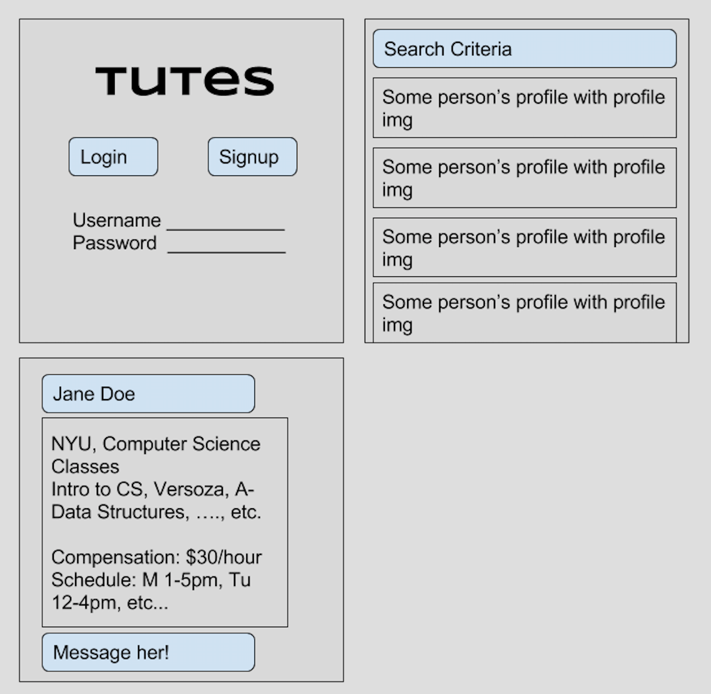
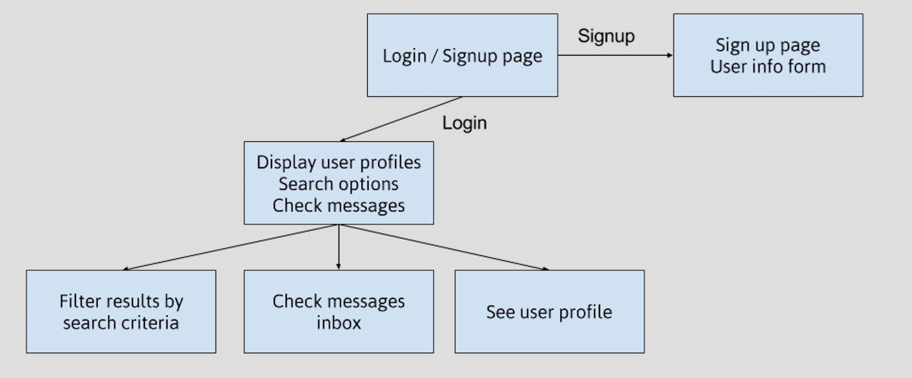

# Tutes

## Overview
It's hard being a student. You are probably juggling classes, assignments, labs, familial obligations, internships, job search, extracurricular activities, sleep, hanging out with your friends, seeing your significant other, hobbies, exercising, etc. Sometimes, something's got to give.

Sometimes, that something is your coursework. I learned a while ago that there's no shame in asking for help. However, from my experiences, I found that there is no easy way to ask for help. Maybe your schedule doesn't work with the professor's office hours, or there aren't enough departmental tutors, or you work better one-on-one. 

Those who are taking responsibility for their learning should be able to easily ask for help and find it. Education should be a fun and collaborative effort.

## Tutes
Tutes is a web application that allows students to be tutors for other students. Tutors create a profile including the classes that they are comfortable tutoring and what they expect as compensation, and students can search through profiles to book a time to meet with the tutor of their choosing.

## Data Model
MongoDB nosql database to store the following objects:

```javascript
/*
 * Used to represent a user profile, both tutors and tutees.
 * Tutees who do not wish to tutor can set Boolean tutor to false, and subsequently
 * Will not be asked to fill out parts of the form specific to tutors.
 */
var User = new mongoose.Schema({
	tutor: Boolean,
	location: String,
	school: String,
	gpa: Number,
	classYear: {enum: ['Freshman', 'Sophomore', 'Junior', 'Senior', 'Grad', 'Ph.D']},
	aboutMe: String,
	compensation: Number,
	classes: [{type: mongoose.Schema.Types.ObjectId, ref: 'Class'}],
	messages: [{type: mongoose.Schema.Types.ObjectId, ref: 'Message'}],
	availability: [{type: mongoose.Schema.Types.ObjectId, ref: 'Schedule'}]
});

/*
 * Represents a class that the tutor is comfortable tutoring, including the professor,
 * semester taken, and the grade received from the class.
 */
var Class = new mongoose.Schema({
	className: String,
	professor: String,
	semesterTaken: String,
	grade: {enum: ['A', 'A-', 'B+', 'B', 'B-', 'C+', 'C', 'C-', 'D+', 'D', 'D-', 'F']}
});

/*
 * A message sent from one person to another. Will be stored within the User object
 * of the recipient of the message.
 */
var Message = new mongoose.Schema({
	from: {type: mongoose.Schema.Types.ObjectId, ref: 'User'};
	timestamp: Number,
	message: String
});

/*
 * Schedule for availability to tutor for all days of the week.
 */
var Schedule = new mongoose.Schema({
	monday: [{type: mongoose.Schema.Types.ObjectId, ref: 'TimeInterval'}],
	tuesday: [{type: mongoose.Schema.Types.ObjectId, ref: 'TimeInterval'}],
	wednesday: [{type: mongoose.Schema.Types.ObjectId, ref: 'TimeInterval'}],
	thursday: [{type: mongoose.Schema.Types.ObjectId, ref: 'TimeInterval'}],
	friday: [{type: mongoose.Schema.Types.ObjectId, ref: 'TimeInterval'}],
	saturday: [{type: mongoose.Schema.Types.ObjectId, ref: 'TimeInterval'}],
	sunday: [{type: mongoose.Schema.Types.ObjectId, ref: 'TimeInterval'}],
});

/*
 * The starting and ending time that a user is available to tutor in any day.
 */
var TimeInterval = new mongoose.Schema({
	start: Number;
	end: Number;
});
```

## Wireframe


## Site Map


## Use Cases
* I am a student and I want to find a tutor for Data Structures because I don't know how to do the assignment.
* I am a student and I want be a tutor because I want to make some extra money.
* i am a student and I want to tutor people for free because it makes me feel good :)
* I am a teacher and I want to tutor people because I'm an expert so why not.
* I am a new grad and I want a side job.
* I am a student and I'm not sure what classes to take next semester, so I want to talk to someone who has taken the class.

## Research
* Possible maps integration (Google maps?)
* Calendar integration
* User accounts
* Message passing
* Integrate API for payments
